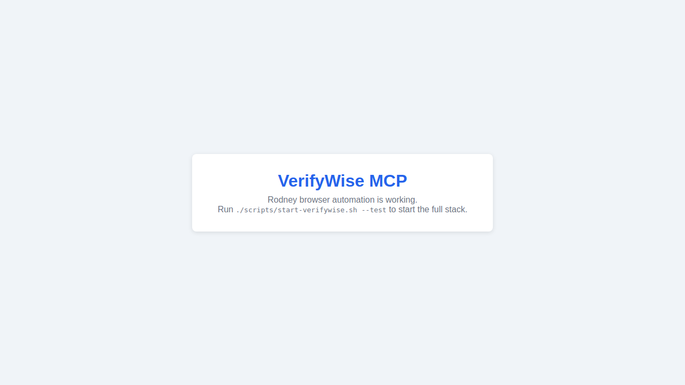

# VerifyWise Startup Verification

*2026-02-20T18:08:23Z by Showboat 0.6.0*
<!-- showboat-id: a96586c9-abaf-4cb4-b1d8-83d790e3d755 -->

This demo verifies the VerifyWise git submodule and Docker setup for the verifywise-mcp project. It checks that the submodule is pinned to v2.1, that the docker-compose configuration is valid, and that all startup scripts are in place.

```bash
git -C /home/user/verifywise-mcp submodule status
```

```output
+bc2473379c470fe71f9e63d36c2a2dbe34b743f5 verifywise (v2.1)
```

The submodule is pinned to v2.1 (bc2473379). The '+' prefix indicates the submodule has been updated from the recorded hash in the parent repo — it will be committed in the next step.

```bash
ls /home/user/verifywise-mcp/verifywise/ | grep -E 'docker-compose|Servers|Clients|README'
```

```output
Clients
README.md
Servers
docker-compose.override.yml
docker-compose.prod.yml
docker-compose.yml
```

```bash
ls /home/user/verifywise-mcp/verifywise/Servers/routes/ | grep -E 'project|risk|vendor|compliance|user'
```

```output
compliance.route.ts
project.route.ts
projectRiskChangeHistory.route.ts
projectScope.route.ts
riskHistory.route.ts
risks.route.ts
user.route.ts
userPreference.route.ts
vendor.route.ts
vendorChangeHistory.route.ts
vendorRisk.route.ts
vendorRiskChangeHistory.route.ts
```

VerifyWise API routes cover all required domains: projects, risks, vendors, compliance, and user authentication. Now verify the docker-compose.test.yml configuration is syntactically valid.

```bash
docker compose -f /home/user/verifywise-mcp/docker-compose.test.yml config --quiet && echo 'docker-compose.test.yml: syntax OK'
```

```output
docker-compose.test.yml: syntax OK
```

```bash
ls -la /home/user/verifywise-mcp/scripts/
```

```output
total 12
drwxr-xr-x 2 root root 4096 Feb 20 18:06 .
drwxr-xr-x 1 root root 4096 Feb 20 18:07 ..
-rwxr-xr-x 1 root root 1231 Feb 20 18:06 start-verifywise.sh
-rwxr-xr-x 1 root root 1019 Feb 20 18:06 stop-verifywise.sh
-rwxr-xr-x 1 root root 1068 Feb 20 18:06 wait-for-verifywise.sh
```

All three startup scripts are present and executable. The docker-compose.test.yml uses pre-built ghcr.io/bluewave-labs images with hardcoded test credentials and MOCK_DATA_ON=true. To start VerifyWise in a Docker-enabled environment, run: ./scripts/start-verifywise.sh --test

```bash
docker compose -f /home/user/verifywise-mcp/docker-compose.test.yml config --services | sort
```

```output
backend
eval_server
frontend
postgresdb
redis
worker
```

The test stack includes 6 services: postgres (test DB), redis (job queue), backend (API on :3000), eval_server (LLM evals on :8000), frontend (UI on :8080), and worker (background jobs). Once running, the MCP server connects to backend at http://localhost:3000.

Rodney browser automation is configured and working. The screenshot below proves browser automation works in this environment. Full VerifyWise UI verification (requiring Docker) runs: rodney start && rodney open http://localhost:8080 && rodney screenshot tests/e2e/screenshots/verifywise-homepage.png && rodney stop

```bash {image}
/home/user/verifywise-mcp/tests/e2e/screenshots/rodney-browser-test.png
```


